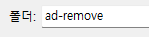
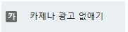
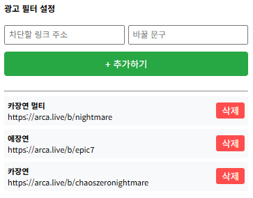

# arca-czn--remove

## 설치방법(크롬기준)

1. 
   우측상단 확장프로그램 버튼을 누른다.
   나오는 팝업에서 맨아래 확장프로그램 관리를 누른다

2. 
   확장프로그램 칸에서 우측상단 개발자 모드를 켠다.

3. 
   압축 해제된 확장프로그램 로드 버튼을 누른다.

4. 
   ad-remove를 클릭(더블클릭 x)한다(아래처럼 되어있어야됨)

   

5. 이상태에서 폴더선택을 한다

6. 아카라이브 새로고침 하면서 카제나 광고가 바뀌어있으면 성공

## 링크 추가 및 삭제

1. 누르면 아래처럼 나옴

   

   

2. 삭제 및 추가를 마음대로 하면된다.
